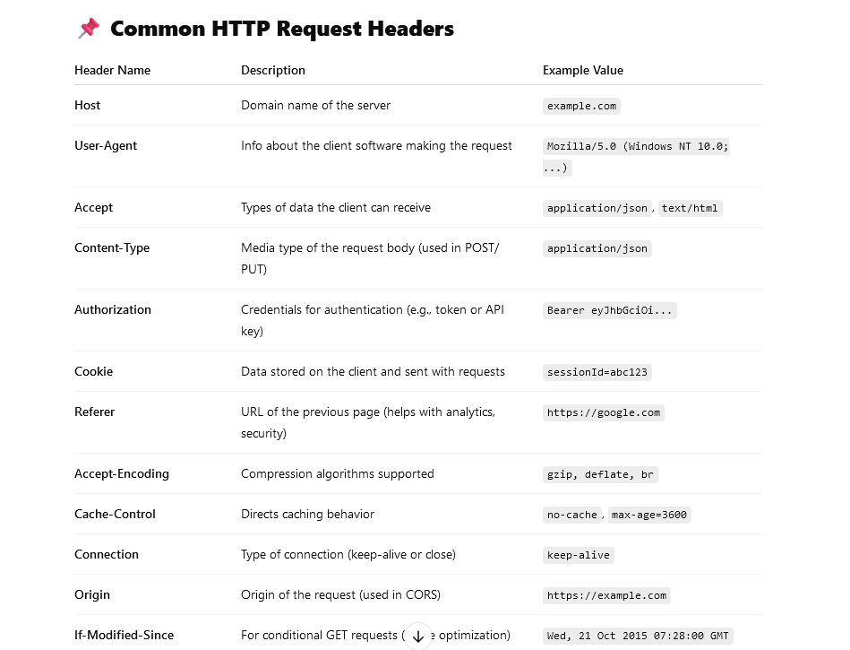
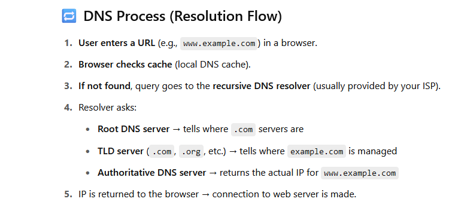

# 01-introduction-OSI-model.md

### Internet 
* Internet - collection of networks connected to each other.
* IP address (internet protocol address) - unique identifier for a computer on a network. 
  * IPv4 - 32-bit address
  * IPv6 - 128-bit address
  * IPv4 vs IPv6 -
    * IPv4 has 4.3 billion addresses
    * IPv6 has 340 undecillion addresses

* DNS (Domain Name System) - translates domain names to IP addresses. The Domain Name System is the hierarchical and decentralized naming system used to identify computers on the internet.
* Communication protocols - rules that define how data is transmitted over a network.
* Packet - unit of data that is sent over a network.

### Network - use for communication, shared resources.
- collection of computers connected to each other to share resources.These devices are connected using physical wires such as fiber optics, but they can also be wireless
  * LAN (Local Area Network) - network that connects computers in a limited geographical area , such as within a home, a building or one site. A LAN can be created to share data or hardware such as a printer/fax/scanner, or to share an internet connection o program.
  * WAN (Wide Area Network) - network that connects computers over a large geographical.For example, a company with an office in London and another in Beijing would use a WAN to allow the employees to share one network.Some companies will connect a number of LANs in different areas together to create a WAN. This is Internet.

* ARPANET(1960) first WAN - first network to use the internet protocol suite. Their aim was to help American military technology stay ahead of its enemies and prevent surprises

###  What happens when you type a URL into a browser - 
- search query or URL --> URL is a web address that specifies the location of a web page on the internet. A URL consists of several components, including the protocol (e.g., HTTP, HTTPS), the domain name (e.g., www.example.com), and the path to the specific resource (e.g., /index.html). If this structure not there then search query.


    ### 1. URL Parsing and Validation
    - The browser checks if the entered URL is valid.
      - It identifies the protocol (e.g., HTTP, HTTPS) and the domain (e.g., `www.example.com`).
      - The browser checks if the URL needs to be served from HTTP or HTTPS. The browser checks its "preloaded HSTS (HTTP Strict Transport Security)" list. This list keep on updating by the browser vendors. If the domain is in the list, the browser will automatically switch to HTTPS.
        
    
    
    ### 2. DNS Resolution - it is the process of converting a domain name into an IP address. Port not required for DNS resolution.
    - The browser queries the **Domain Name System (DNS)** to translate the human-readable domain name into an IP address (e.g., `93.184.216.34`), which is needed to locate the server on the internet.
      - If the IP address is cached (Browser's cache, Local Host file (/etc/hosts),  on the router, or ISP's DNS servers), the full DNS lookup is skipped.
    
    ### 3. Establishing a Connection - same TCP connection can be used for multiple HTTP/HTTPS requests.
    - **TCP Connection:** A connection is established between your device and the server using the **Transmission Control Protocol (TCP)**.
      - **TLS/SSL Handshake (if HTTPS):** For secure websites, a secure connection is established using **TLS/SSL**, ensuring data privacy.
    
    
    ### 4. Sending an HTTP(S) Request
    - The browser sends an **HTTP(S) request** to the server. This request includes:
        - Request method (e.g., GET, POST).
        - URL path (e.g., `/index.html`).
        - Headers (e.g., browser type, cookies, accepted formats).
        - Optional data (for POST requests).
    
    
    ### 5. Server Processing
    - The server receives the request, processes it, and determines how to respond.
      - It fetches the required resources (e.g., HTML, CSS, JavaScript, images) and generates a response.
    
    
    ### 6. HTTP(S) Response
    - The server sends back an **HTTP(S) response** to the browser. This includes:
        - Status code (e.g., 200 OK, 404 Not Found).
        - Response headers (e.g., content type, cache instructions).
        - The requested content (e.g., the HTML of the webpage).
    
    ### 7. Rendering the Webpage
    The browser processes the response and starts rendering the page:
    1. **HTML Parsing:** The browser parses the HTML and constructs the **DOM (Document Object Model)** tree.
       2. **CSS Parsing:** It fetches and applies styles to create the **render tree**.
       3. **JavaScript Execution:** If the page includes JavaScript, the browser executes the scripts to manipulate the DOM or perform other tasks.
       4. **Image and Resource Loading:** Other resources like images, videos, or fonts are fetched asynchronously and integrated into the page.
    
    
    ### 8. User Interaction
    - The fully rendered page is displayed, and you can now interact with it.
      - Any subsequent actions (e.g., clicking a link or submitting a form) might trigger additional HTTP requests.

### Optimizations and Advanced Details
Modern browsers and servers optimize this process through:
- **Caching:** Avoiding redundant requests by storing previously fetched resources locally.
- **CDNs (Content Delivery Networks):** Serving resources from servers geographically closer to the user.
- **Preloading/Prefetching:** Predictively fetching resources based on user behavior.
- **Compression:** Using protocols like Gzip or Brotli to reduce data size.

### OSI Model - Open Systems Interconnection Model 
* The OSI model is used to understand how networks operate and how data is transmitted from one computer to another.
* The OSI model is a theoretical model, and in practice, the TCP/IP model is more commonly used.
* Separation of Responsibility, Abstraction (hide complexity), Hierarchical, Layered Model
* It’s based on the concept of splitting up a communication system into seven abstract layers, each one stacked upon the last.
* Each layer has a specific function and interacts with the layers above and below it.
* The OSI model is divided into seven layers:
  *  Layers -      

         **Application Layer** - Closest to the end-user, it interacts directly with software applications to provide communication services (e.g., HTTP/HTTPS, FTP, DNS, SMTP/POP3/IMAP).
    
         **Presentation Layer** - Responsible for data formatting, encryption, compression. Protocol - SSL/TLS
    
         **Session Layer** - Establishes, maintains, and terminates communication sessions between appllication.  Protocol - NetBIOS, RPC
    
         **Transport Layer** - End to end communication. Commnication between two devices. Data converted into segment. Ensures reliable data transfer through error detection, retransmission, and flow control and error control. Protocols include TCP and UDP. Gaurantee of delivery, falut tolerance, in-order transmission.
    
         **Network Layer** - Routing, logical addressing - Divide segment into packets. Packets routing done here. Handles logical addressing and routing of data between devices across different networks. Protocols include IP and ICMP.
    
         **Data Link Layer** - Physical addressing, error detection - Similar to netwrok layer, care about only next hop in the network. Hop to hop transfer. Provides error detection and correction for data transmitted over the physical layer. Protocol -- MAC, Ethernet.
    
         **Physical Layer** - The lowest layer, Hardware -  Convert into BitSTream 0 or 1. it deals with the physical transmission of raw binary data over hardware like cables, switches, and wireless signals. 


💡 Key Points

    Top 3 layers (7–5): Deal with how applications communicate

    Middle layer (4): Ensures delivery of data

    Bottom 3 layers (3–1): Deal with data transmission and routing


### Some commands to get started

1. Find the IP address of the server you want to connect to. `nslookup <domain>`
2. Find the domain name from a given IP address (also who own domain). `whois <ip>`
3. `ifconfig`
4. Follow a network packet `traceroute <domain>` -- shows the path taken by packets across an IP network.it tells what all hops it takes to reach final server. hop to hop communication. 

---

* checksum - is a hash value value that is calculated from a data set. It is used to detect errors in data transmission. When data is transmitted over a network, the checksum is calculated at the sender's end and then recalculated at the receiver's end. If the two checksums do not match, an error has occurred during transmission.


# 02-application-layer.md

### Client-server
- The client-server model is the relationship between two computers in which one, the client, makes a service request from another, the server. The key point about a client-server model is that the client is dependent on the server to provide and manage the information.
- Browser, Mobile apps, Desktop apps are clients. Server is a computer that provides data to other computers.
- For example, websites are stored on web servers. A web browser is the client which makes a request to the server, and the server sends the website to the browser.
- Also knows as Synchronous path or Sync path


### Peer-to-peer (P2P) 
- decentralized model - A network where each node (peer) acts as both a client and a server. 
- In the client-server model, many users trying to access a large file, such as a film, would put strain on one server. In the peer-to-peer model, many users on the network could store the same file. Each computer can then send sections of the file, sharing the workload. Each client can download and share files with other users.
- In P2P - other protocol will not work like - http/https. It will work on BitTorrent protocol.


> In a P2P network, no single provider is responsible for being the server. Each computer stores files and acts as a server. Each computer has equal responsibility for providing data

Some applications of the peer-to-peer model are:
* Content delivery - Torrents
* File sharing - Torrents, DC++
* Cryptocurrency - work on Blockchain which uses peer to peer model.
* Tesla Car

### BitTorrent - P2P Protocol

The BitTorrent protocol can be used to reduce the server and network impact of distributing large files. Rather than downloading a file from a single source server, the BitTorrent protocol allows users to join a "swarm" of hosts to upload and download from each other simultaneously. Using the BitTorrent protocol, several basic computers, such as home computers, can replace large servers while efficiently distributing files to many recipients.


* To download a file, the user needs to have a BitTorrent client installed on their computer. - bit torrent Utorrent, Bit torrent.
* A user downloads a `.torrent` file which contains a list of trackers.
* Tracker e.g. - pirateBay
* The "tracker" server keeps track of where file copies reside on peer machines, which ones are available at time of the client request, and helps coordinate efficient transmission and reassembly of the copied file.
* The file being distributed is divided into segments called pieces. As each peer receives a new piece of the file, it becomes a source (of that piece) for other peers, relieving the original seed from having to send that piece to every computer or user wishing a copy.
* When a user initiates the download, the client gets a list of peers from the tracker.
* Pieces are typically downloaded non-sequentially, and are rearranged into the correct order by the BitTorrent client, which monitors which pieces it needs, and which pieces it has and can upload to other peers
* seeders - bring actually data bring/generate data in network
* leechers - download data from network
 
### Differences between client-server and peer-to-peer -

|             | Client-server                                                                          | Peer-to-peer                                                            |
| ----------- | -------------------------------------------------------------------------------------- | ----------------------------------------------------------------------- |
| Security    | The server controls security of the network.                                           | No central control over security.                                       |
| Management  | The server controls security of the network.                                           | No central control over security.                                       |
| Dependency  | The server manages the network. Needs a dedicated team of people to manage the server. | No central control over the network. Anyone can set up.                 |
| Performance | The server can be upgraded to be made more powerful to cope with high demand.          | If machines on the network are slow they will slow down other machines. |
| Backups     | Data is all backed up on the main server.                                              | Each computer has to be backed up. Data can easily be deleted by users. |


* Spotify uses hybrid model - client server and P2P model and tht is why it is able to provide music to users even in slow internet connection And better than Apple Music.
* Tesla cars have P2P network to update software and share data (traffic).

### Http Method/Verbs - 
- POST & PATCH are both not-idempotent, all others are idempotent.
- Crete - POST/PUT - Post is not-idempotent, PUT is idempotent
- Read - GET - Idempotent
- Update - PUT/PATCH - PUT is idempotent, Patch is not-idempotent
- Delete - DELETE  - Idempotent
- HEAD - Idempotent - same as GET but only returns headers, not the body. It is used to check if a resource exists and to get metadata about the resource.
- OPTIONS - Idempotent - used to describe the communication options for the target resource. It is used to check what HTTP methods are supported by the server for a specific resource.

##### Post vs Put -
* Post - id generated by server, new resource created. Put - id provided by client, resource updated.
* Idempotent -- PUT is idempotent, POST is not. If you make the same PUT request multiple times, the result will be the same. But if you make the same POST request multiple times, the result will be different each time.

##### Put vs Patch 
* put is replace the resource, patch is update the resource. Put is idempotent, patch is not.

* Path parameter - /users/123 - 123 is path parameter
* Query parameter - /users?name=kapil - name is query parameter
* Payload - data sent in body of request


```
* Real API Example (REST)

GET     /users/123         → Get user with ID 123  
POST    /users             → Create a new user  
PUT     /users/123         → Replace user 123  
PATCH   /users/123         → Update part of user 123  
DELETE  /users/123         → Delete user 123
```


### HTTP request headers

HTTP request headers are key-value pairs sent from the client (like a browser or app) to the server, giving extra context about the request — such as who’s sending it, what format is expected, and more



Some common headers are:
* Host - The host header specifies the domain name or IP address of the server receiving the request.
* User-Agent - The User-Agent header specifies the name of the user agent originating the request.
* Accept - The Accept header is used to specify what content types the client is willing to accept.
* Connection - The Connection header is used to control whether the connection should be closed after the request is complete.

```angular2html
Example Request with Headers

GET /api/user HTTP/1.1
Host: example.com
User-Agent: Mozilla/5.0
Accept: application/json
Authorization: Bearer eyJhbGciOi...

```

See a complete list of HTTP headers [here](https://developer.mozilla.org/en-US/docs/Web/HTTP/Headers).

##### HTTP status codes

HTTP status codes are 3-digit codes most often used to indicate whether an HTTP request has been successfully completed. Status codes are broken into the following 5 blocks:

| Code Range | Category      | Description                                         |
| ---------- | ------------- | --------------------------------------------------- |
| **1xx**    | Informational | Request received, continuing process                |
| **2xx**    | Success       | The request was successfully received and processed |
| **3xx**    | Redirection   | Further action needs to be taken                    |
| **4xx**    | Client Error  | The request has bad syntax or cannot be fulfilled   |
| **5xx**    | Server Error  | Server failed to fulfill a valid request            |


For example, a status code of 200 indicates that the request has been successfully completed.
On the other hand, a status code of 404 indicates that the requested resource was not found.
Find a list of all HTTP status codes [here](https://developer.mozilla.org/en-US/docs/Web/HTTP/Status).

##### HTTP response headers
A response header is an HTTP header that can be used in an HTTP response and that doesn't relate to the content of the message. Response headers, like Age, Location or Server are used to give a more detailed context of the response.


Some common response headers are:
* Server - The Server header specifies the software used to handle the request.
* Content-Type - The Content-Type header specifies the media type of the body of the response.
* Content-Length - The Content-Length header specifies the length of the body of the response.
* Content-Encoding - The Content-Encoding header specifies the encoding used for the response body.
* Keep-Alive - The Keep-Alive header specifies the period of time that the connection should be kept alive.

### https://Httptoolkit.com - to see the request and response of the network.

HTTP/1.1 200 OK
Content-Type: application/json


# 🌐 Most Common HTTP Status Codes
HTTP status codes are standardized three-digit responses from a server indicating the result of a client’s request.
---
## 🔵 1xx – Informational
| Code | Meaning             | Description                                               |
|------|---------------------|-----------------------------------------------------------|
| 100  | Continue            | The initial part of a request was received; continue     |

## ✅ 2xx – Success

| Code | Meaning     | Description                                           |
|------|-------------|-------------------------------------------------------|
| 200  | OK          | The request succeeded and the response contains data |

## 🔁 3xx – Redirection

| Code | Meaning            | Description                                              |
|------|--------------------|----------------------------------------------------------|
| 301  | Moved Permanently  | Resource has permanently moved to a new URL             |

## ❌ 4xx – Client Errors
| Code | Meaning            | Description                                            |
|------|--------------------|--------------------------------------------------------|
| 400  | Bad Request        | The server cannot process the malformed request        |
| 401  | Unauthorized       | Authentication is required or failed                   |
| 403  | Forbidden          | Authenticated, but not allowed to access the resource  |
| 404  | Not Found          | The requested resource doesn't exist                   |
| 429  | Too Many Requests  | Client sent too many requests in a short time          |

## ⚠️ 5xx – Server Errors
| Code | Meaning               | Description                                                |
|------|-----------------------|------------------------------------------------------------|
| 500  | Internal Server Error | Generic server-side error                                  |
| 502  | Bad Gateway           | Invalid response from an upstream server                   |
| 503  | Service Unavailable   | Server is temporarily down (e.g., maintenance, overload)   |
| 504  | Gateway Timeout       | Upstream server failed to respond in time                  |


> 📝 *Tip: Use status codes consistently in REST APIs for better client-server communication.*


# 03-cookies-dns-tcp.md

### TCP vs UDP 
  * TCP (Transmission Control Protocol) - connection-oriented protocol that provides reliable data transfer. It ensures that data is delivered in the correct order and without errors. TCP is used for applications that require high reliability, such as web browsing, email, and file transfer.
  * UDP (User Datagram Protocol) - connectionless protocol that provides fast data transfer but does not guarantee delivery. or especially time-sensitive transmissions such as online gaming, video streaming, video playback or DNS lookups. UDP is used for applications that require speed and efficiency. 


| Feature            | **TCP (Transmission Control Protocol)**              | **UDP (User Datagram Protocol)**               |
|--------------------|------------------------------------------------------|------------------------------------------------|
| **Connection**     | Connection-oriented: establishes a session           | Connectionless: sends data without setup       |
| **Reliability**    | Reliable: ensures delivery with acknowledgment       | Unreliable: no guarantee of delivery           |
| **Ordering**       | Guarantees delivery order of packets                 | No ordering guarantees                         |
| **Error control ** | Yes, with retransmissions on failure                 | Yes, but no retransmission or recovery         |
| **Speed**          | Slower (due to connection setup and reliability)     | Faster (minimal overhead)                      || 
| **Use Cases**      | Web, email, file transfer (HTTP, SMTP, FTP)          | Streaming, DNS, gaming, VoIP                   |
| **Flow Control**   | Yes: prevents sender from overwhelming receiver      | No                                             |

 
* 3 way handshake - is a method used in TCP to establish a reliable connection between a client and a server before data transmission begins.
  1. **SYN (synchronize)** – Client sends a request to start communication.
  2. **SYN-ACK (synchronize-acknowledge)** – Server acknowledges and replies.
  3. **ACK (acknowledge)** – Client acknowledges the server response.

```
| Step | Sender  | Flags     | Description                          |
|------|---------|-----------|--------------------------------------|
| 1    | Client  | SYN       | Client initiates connection          |
| 2    | Server  | SYN + ACK | Server acknowledges and responds     |
| 3    | Client  | ACK       | Client acknowledges server’s reply   |
```
After this handshake, a reliable TCP connection is fully established and data can be transferred between client and server.
Same TCP connection can be use for multiple HTTP/HTTPS requests.

### Cookies 
- HTTP is a stateless protocol, meaning that the server does not maintain any state. To provide a better user experience, such as remembering if user is logged in, state is required to be maintained. Cookies are a way to achieve state in HTTP request and response cycles.
    * A cookie is a small piece of data stored on the client's computer by the web server. It is sent back to the server with every request made by the client.
    * Cookies are used to store information about the user, such as login credentials, shopping cart items, or user preferences.
    * Cookies can be set with an expiration date, after which they are automatically deleted.    
    * Cookies can be used to store session information, such as login tokens, to maintain user sessions.

The server is responsible for creation of the cookies. A web server specifies a cookie to be stored by sending an HTTP header called Set-Cookie


### Request and response lifecycle
1. The browser sends its first HTTP request for the homepage of the `www.slow.com` website

    ```
    GET /index.html HTTP/1.1
    Host: www.slow.com
    ...
    ```

2. The server responds with the data and `Set-Cookie` headers field

    ```
    HTTP/1.0 200 OK
    Content-type: text/html
    Set-Cookie: theme=light
    Set-Cookie: sessionToken=abc123; Expires=Wed, 09 Jun 2021 10:18:14 GMT
    ...
    ```

   The server's HTTP response contains the contents of the website's homepage. But it also instructs the browser to set two cookies. 
   * Session cookie - `theme`, is considered to be a session cookie since it does not have an Expires or Max-Age attribute. Session cookies are intended to be deleted by the browser when the browser closes.

   * Persistent cookie - `sessionToken`, is considered to be a persistent cookie since it contains an Expires attribute, which instructs the browser to delete the cookie at a specific date and time and remains even after browser is closed until time expire.


3. Next, the browser sends another request to visit the spec.html page on the website. This request contains a Cookie header field, which contains the two cookies that the server instructed the browser to set:

    ```
    GET /spec.html HTTP/1.1
    Host: www.slow.com
    Cookie: theme=light; sessionToken=abc123
    …
    ```

   This way, the server knows that this HTTP request is related to the previous one.


### DNS -
* The Domain Name System (DNS) is the phonebook of the Internet. translates domain names to IP addresses. The Domain Name System is the hierarchical and decentralized naming system used to identify computers on the internet.


* 🔁 DNS Lookup Flow - 



---

* 🧠 DNS Components

| Component             | Description                                             |
|-----------------------|---------------------------------------------------------|
| **Root Server**       | Knows where TLD servers are                             |
| **TLD Server**        | Knows where domain is hosted                            |
| **Authoritative DNS** | Provides final IP address                               |
| **Recursive Resolver**| Queries and returns result to the user                  |

---

* 📦 Common DNS Record Types

| Record  | Use                         | Example                          |
|---------|-----------------------------|----------------------------------|
| A       | Domain → IPv4               | example.com → 93.184.216.34      |
| AAAA    | Domain → IPv6               |                                  |
| CNAME   | Alias to another domain     | www → example.com                |
| MX      | Mail server info            |                                  |
| NS      | Authoritative name servers  |                                  |
| TXT     | Misc. text (e.g., SPF, DKIM)|                                  |


* Recursive resolver - The recursive resolver is a server that receives DNS queries from clients and resolves them by querying the DNS hierarchy. The recursive resolver is responsible for finding the IP address associated with a domain name.
* Root DNS servers - The root server is the first step in translating (resolving) human-readable hostnames into IP addresses. These servers are located around the world and are responsible for delegating DNS requests to Top Level Domain (TLD) nameservers.
* TLD (Top Level Domain) - The highest level of domain names in the root zone of the Domain Name System of the Internet. For example, .com, .org, .net, .gov, .edu, etc.
* Authoritative nameserver - The authoritative nameserver is the DNS server that holds the DNS records (A, CNAME, MX, TXT, etc.) for a domain. This server responds to DNS queries for the domain it is authoritative for.


### SSL Offloading / SSL Termination  
- is a process where the SSL (Secure Sockets Layer) encryption and decryption workload is transferred from a web server to another device, typically a load balancer. By doing so, the web server can focus on processing application logic instead of handling the computational overhead of encryption and decryption.
* Key Components of SSL Offloading:

    * Encryption/Decryption: The offloading device handles the encryption of outgoing traffic and decryption of incoming traffic.
    * Certificate Management: SSL certificates are stored and managed on the offloading device.
    * Load Balancing: Often combined with load balancing to distribute traffic efficiently while ensuring security.

Benefits of SSL Offloading:

    - Improved Server Performance: Servers are freed from the resource-intensive task of encryption and decryption.
    - Centralized SSL Management: Easier certificate management on a single device instead of multiple web servers.
    - Scalability: Enables better handling of increased traffic without overburdening the application servers.
    - Security Features: Some devices provide additional features like intrusion detection and application-layer security.

Example Use Case:

    A load balancer, such as an F5 or NGINX, is configured for SSL offloading. The load balancer decrypts the HTTPS requests from clients and forwards them as HTTP to the backend servers. HTTP requests are faster thjan HTTPS due to security. Responses are then encrypted back into HTTPS before being sent to the clients.

HTTPS -- HTTP + SSL (Secure Socket Layer) / TLS (Transport Layer Security)

LocalHost - 127.0.0.1 -- defined alias for localhost in /etc/hosts file

Ports - identify the type of service running on a server.Below are standard ports. Custom port has to be passed into URL.
    Http port - 80
    Https port - 443
    SSH port - 22
    FTP port - 21
    SFTP port - 22

SSL Certificate - is a digital certificate that authenticates the identity of a website and encrypts information sent to the server using SSL technology. SSL certificates are used to secure credit card transactions, data transfer, logins, and other personal information. They provide security to customers.

Google's public DNS server are below, Netflix has his own DNS server. 
- 8.8.8.8. 
- 8.8.4.4.

* TCP - Host to Host communication
* HTTP/HTTPS - Process to process communication
* UDP - Process to process communication